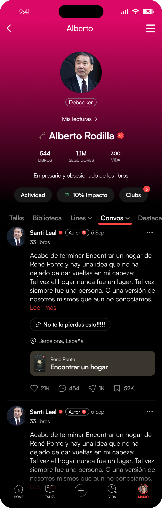

# 📱 Debook — Frontend (React Native + Expo)

App móvil que reproduce la **pantalla de perfil** de Debook y su feed de _Convos_, consumiendo el [backend](../backend/README.md) que completas.

La app **ya compila y arranca**, con la capa de datos cableada y un andamiaje mínimo de la pantalla. Completa los `TODO` y llévala a **pixel perfect**.

---

## 🎨 El diseño

Reprodúcelo **1:1** desde el Figma (fuente de verdad — colores, medidas, tipografía, todo):

**Figma:** <https://www.figma.com/design/ef5IRANCX4qEFsh50z4CpL/Prueba-Full-Stack-Debook?node-id=1-1503>



> Lo que te damos en código es **andamiaje**: estructura y datos, con estilos placeholder. El diseño lo sacas tú del Figma. Usa tokens/constantes, no valores mágicos sueltos.

---

## 🚀 Puesta en marcha

Requisitos: **Node ≥ 18** y el [backend](../backend/README.md) levantado.

```bash
cd frontend
npm install
npm run ios      # o: npm run android / npm start (Expo Go)
```

- iOS / web: `localhost` por defecto. Android emulator: `10.0.2.2` automático.
- Cambiar host (dispositivo físico): env `EXPO_PUBLIC_API_URL` (ver `src/api/client.ts`).

Sin backend, la pantalla muestra su estado de error.

---

## 🧩 Qué implementar

| Archivo | Qué falta |
| --- | --- |
| `src/hooks/useProfilePosts.ts` | Traer los posts del perfil (paginado) + estados. |
| `src/hooks/useToggleLike.ts` | Dar / quitar like desde la app. |
| `src/utils/formatCount.ts` | Formatear los números como en el diseño. |
| `src/utils/formatDate.ts` | Formatear la fecha como en el diseño. |
| Componentes / pantalla | Estilar todo hasta **pixel perfect** con el Figma. |

Como referencia (ya hecho): `useProfile`, el cliente `axios` con `x-user-id`, los tipos y el andamiaje de los componentes.

---

## 🗂️ Estructura

```
frontend/
├── app/                 # Expo Router (_layout: providers · index → ProfileScreen)
└── src/
    ├── theme/tokens.ts  # tokens (placeholders — defínelos desde el Figma)
    ├── api/             # client (axios + x-user-id) · users · posts
    ├── types/           # modelos de la API
    ├── hooks/           # useProfile ✅ · useProfilePosts 🚧 · useToggleLike 🚧
    ├── store/likes.ts   # Zustand
    ├── utils/           # formatCount 🚧 · formatDate 🚧
    ├── components/       # ProfileHeader · ProfileTabs · PostCard · PostActions...
    └── screens/ProfileScreen.tsx
```

---

## 🛠️ Stack

Expo Router · React Query · Zustand · Reanimated · expo-linear-gradient · expo-image · TypeScript estricto.

---

## 📋 Entregables

- Código completo, `.gitignore` correcto (**nunca `.ai-logs/`**).
- La carpeta **`.ai-logs/`** (raíz) con tu registro de IA.
- En tu README de entrega: decisiones técnicas, capturas comparando con el diseño, y qué dejarías para v2.

> **Calidad > cantidad.** Mejor la pantalla clavada y el like impecable que muchas cosas a medias.
